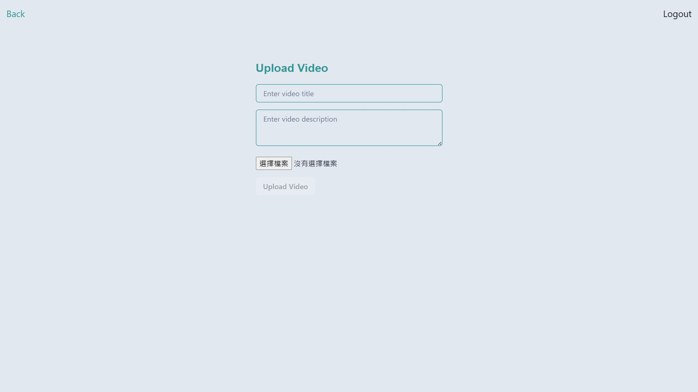

# Fullend Video Streaming System

## Overview

This is a video playback system that consists of two roles: users and administrators. Users can register accounts, upload videos, and watch videos. Administrators have the ability to view all users and perform management tasks.

## Architecture

### Deployment

- **Cloud Provider**: Azure
- **Container Orchestration**: Kubernetes (Azure Kubernetes Service)
- **Object Storage**: Azure Blob Storage

### Frontend

- **Framework**: React.js
- **UI Library**: Chakra UI

### Backend

- **Framework**: FastAPI
- **Authentication**: OAuth2

### Database

- **Database**: PostgreSQL
- **Database Migration**: Alembic
- **Deployment**: Helm

## Feature

**Basic Functions:**

- User login
- Admin login
- Modify user data

- Admin Privileges:

  - Ability to delete users
  - Access to view all user data

**watch video**

**upload video**

after login, user can upload videos

## Demo Video

[Demo Video(Click Here)](https://youtu.be/MZd8qqe7Zww)

Register Account -> Log In -> View User Data -> Update Data -> Watch Video -> Upload Video -> Watch Uploaded Video -> Log Out

Admin Log In -> View Users -> Delete User
